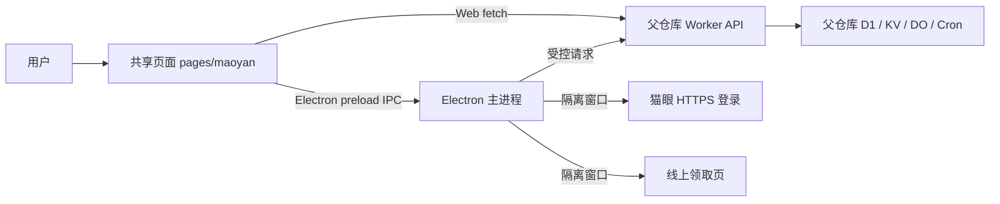

# Movie 代码知识库

本仓库维护共享页面和 Electron 客户端。Web 页面由父仓库 `tools` 发布；Worker 路由、账号认证、D1/KV/DO、Cron、迁移和部署均由父仓库拥有。本子仓库不能独立部署，也不能据此推断生产配置。跨仓库链路参见[父仓库 Movie 架构](https://github.com/shovelshit/tools/blob/master/knowledge/movie.md)，接口变更须两边一起检查。

| 入口 | 内容 |
| --- | --- |
| [共享前端](frontend.md) | Web/Electron 页面、连接、轮询、锁座与座位标识 |
| [Electron 边界](desktop.md) | 主进程、preload、凭据、登录态、更新 |
| [开发与发行](../desktop/README.md) | 安装、测试与打包命令 |

这张图表达代码归属，不表示页面轮询触发 Cron：后台检查由父仓库调度，页面只刷新状态。源码入口：[共享页面](../pages/maoyan/index.html)、[应用编排](../pages/maoyan/app.js)、[桌面入口](../desktop/main/index.js)。
