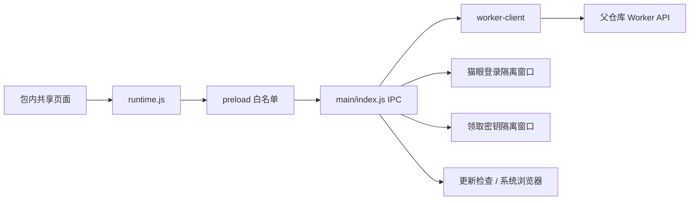

# Electron 客户端边界

[desktop/package.json](../desktop/package.json) 将共享页面和运行脚本收进 asar；[main/index.js](../desktop/main/index.js) 从包内相对路径 `loadFile` 加载 `pages/maoyan/index.html`。主窗口设置 `contextIsolation: true`、`sandbox: true`、`nodeIntegration: false`，限制离开这张 `file:` 页面及新开窗口。[preload/index.js](../desktop/preload/index.js) 用 `contextBridge` 暴露固定方法；页面在 [runtime.js](../pages/maoyan/runtime.js) 选择 Electron 适配，业务脚本不直接使用 Node 或任意 IPC。

## 主进程与 Worker

[main/index.js](../desktop/main/index.js) 注册连接、请求、登录/取消、文件上传、更新、领取和外链 IPC。猫眼登录、上传、更新、领取及外链检查额外核对发起者是主窗口顶层本地页面；页面可调用的方法仍由 preload 固定。[worker-client.js](../desktop/main/worker-client.js) 标准化 HTTP(S) 地址（支持路径前缀，拒绝 URL 凭据/查询/片段），校验 `/api/` 路径、方法、JSON 大小，不允许页面自设请求头；主进程添加 `X-Token`，禁用重定向。非 loopback HTTP 连接及经 HTTP 上传猫眼会话分别要求风险确认。连接成功后才提交 profile/令牌；上传响应丢失时按 `saved_at` 查询同一 profile 的远端状态，仍无法确认则报告结果未知，不盲目重传。

[credential-store.js](../desktop/main/credential-store.js) 在 `safeStorage.isEncryptionAvailable()` 时将加密后的 Worker 令牌持久化到用户数据目录；不可用时只在进程内保存。该机制依赖系统密钥能力，不是跨设备密钥保险箱。`worker-client.js` 另将无令牌的 profile 元信息写入用户数据目录；Web 存储限制见[共享前端](frontend.md)。

## 独立窗口与登录态

[maoyan-login.js](../desktop/main/maoyan-login.js) 创建每次独立的临时 session，只允许猫眼域名 HTTPS 顶层导航，禁止新窗口、下载及权限申请；监听猫眼请求收集必要 cookie、`mtgsig`、查询项和 UA。经 [session-validation.js](../desktop/main/session-validation.js) 校验裁剪后，主进程上传当前 Worker；页面只得到脱敏的上传状态，不接触完整登录态。手动上传通过系统文件选择器读取有大小限制的 JSON，再走同一校验及上传路径。上传发送后的取消或超时不等于失败，应先查询远端状态。结束时清理临时窗口、连接和存储，清理失败提示重启。

[enrollment-window.js](../desktop/main/enrollment-window.js) 用单独的持久隔离 session 加载固定 HTTPS 领取页，只允许限定域名、路径及 `client=desktop` 参数导航；无 preload/Node，仅放行受限的复制权限。领取密钥不会自动注入主窗口。[updates.js](../desktop/main/updates.js) 从固定 GitHub Releases API 检查正式版本并校验发行链接，主进程缓存自动检查时间（手动可重查），外链使用允许列表。更新只在系统浏览器打开下载页/获批链接，由用户手动下载、校验并安装；没有应用内自动安装。完整安装打包步骤见[desktop/README.md](../desktop/README.md)。
