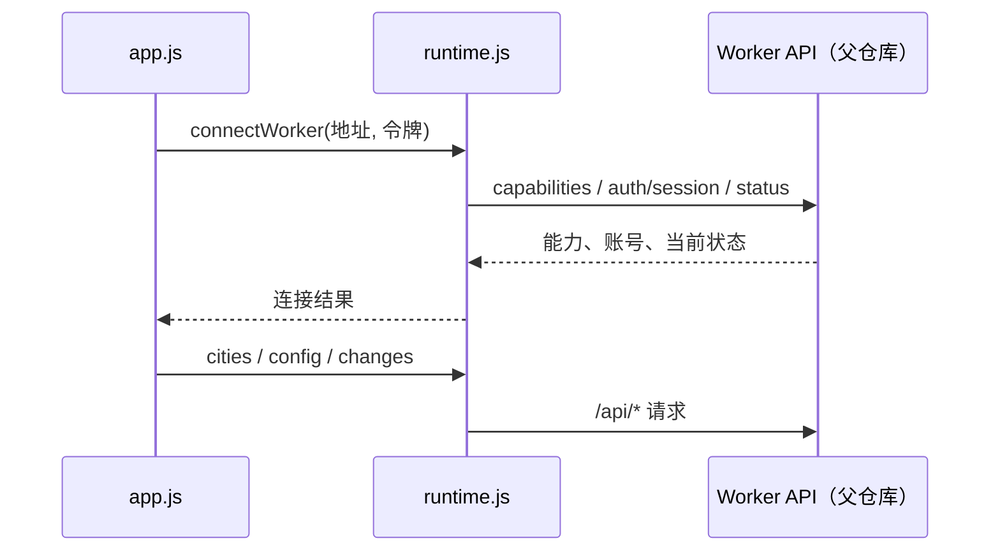

# 共享前端与业务流程

[index.html](../pages/maoyan/index.html) 按依赖顺序加载浏览器脚本，最后加载 [app.js](../pages/maoyan/app.js)。同一份页面供 Web 发布和 Electron 本地 `loadFile` 使用；修改页面后，已安装桌面端仍须重新发包。Web 的领取、下载、管理页另由 [claim.html](../pages/maoyan/claim.html)、[download.html](../pages/maoyan/download.html)、[admin.html](../pages/maoyan/admin.html) 进入。

| 模块 | 当前职责 |
| --- | --- |
| [app.js](../pages/maoyan/app.js) | 连接、配置恢复、影院影片选择、推送和监控配置、刷新及锁座面板编排 |
| [workflow.js](../pages/maoyan/workflow.js)、[ui.js](../pages/maoyan/ui.js) | 四步流程的可达/完成状态、切换及通用页面反馈 |
| [polling.js](../pages/maoyan/polling.js) | 可见且已连接时的状态、变化与活动锁座规则刷新 |
| [runtime.js](../pages/maoyan/runtime.js)、[platform.js](../pages/maoyan/platform.js) | Web fetch/Electron preload 适配、能力开关与平台建议 |
| [connection-profile.js](../pages/maoyan/connection-profile.js)、[secure-store.js](../pages/maoyan/secure-store.js) | 按 Worker URL 隔离 Web 令牌键、浏览器本地加密存储；请求代际在 `runtime.js` |
| [account.js](../pages/maoyan/account.js)、[claim.js](../pages/maoyan/claim.js)、[claim-page.js](../pages/maoyan/claim-page.js) | 账号可用性/续期提示、领取预留与确认及丢失响应的状态恢复 |
| [admin.js](../pages/maoyan/admin.js)、[admin-dashboard.js](../pages/maoyan/admin-dashboard.js) | 管理入口、账号/策略与资源运营视图；管理请求使用 `X-Admin-Token` |
| [seat-layout.js](../pages/maoyan/seat-layout.js)、[lock.js](../pages/maoyan/lock.js) | 座位展示标签推导与锁座规则、会话交互 |

## 连接与请求

`app.connect()` 标准化 Worker 地址，再调用 `maoyanRuntime.connectWorker()`。Web 在 [runtime.js](../pages/maoyan/runtime.js) 中依次请求 `/api/capabilities`、`POST /api/auth/session`、`/api/status`，后续 `/api/*` 请求带 `X-Token`；Electron 走 preload 和主进程 [worker-client.js](../desktop/main/worker-client.js)，账号生命周期能力兼容路径可能读取 `/api/account`。两端以 Worker 返回的账号/能力/状态为准，随后 `app.js` 取城市、恢复 `/api/config`、刷新变化记录。Web 令牌由 [secure-store.js](../pages/maoyan/secure-store.js) 加密存入 localStorage，但盐和派生材料也在本机，不能抵御注入页面的脚本。切换地址会清理旧影院、影片、锁座 UI，请求代际防止旧结果污染新连接。

## 配置与刷新

[workflow.js](../pages/maoyan/workflow.js) 根据连接、影院、影片、推送验证和监控状态推导步骤，不允许进入尚不可达的面板；`app.js` 负责城市/影院/场次查询、`/api/config` 保存、`/api/check` 手动检查、`/api/test-push` 验证和监控开关。平台探测只建议通知渠道，不替代用户选择。服务端下发的 `cronText`、`cronMinutes` 用于显示当前批次；页面初始化占位文案及历史产品天数不是生产策略。

[polling.js](../pages/maoyan/polling.js) 仅在已连接且页面可见时刷新：锁座面板打开且有活动规则时每 15 秒，否则仅第 4 步且监控启用时每 180 秒；失败至少 60 秒后重试。先读 `/api/status?view=summary`，变化版本变化或手动强刷才读 `/api/changes`，需要时刷新锁座远端状态。隐藏页暂停定时器、重新可见立即刷新，切换 profile 重置变化游标。这是 UI 读状态节奏，并非云端监控/锁座调度频率。

## 锁座与座位标识

[lock.js](../pages/maoyan/lock.js) 读取官方/模板座位、会话及规则，负责选择、风险确认、提交或取消 `/api/lock/rule`；实际锁座和创建订单在 Worker，前端不自动支付。[seat-layout.js](../pages/maoyan/seat-layout.js) 用 `rowLabel`/`rowId`、`seatNumber`/`columnId` 和可能含分段的 `seatNo` 推导“几排几座”，无法推导则原样显示。选择集合和规则请求仍使用原始 `seatNo`（`seatNos` 数组），不能用展示标签替换或改写标识；管理视图也优先标签、回退原始值。
